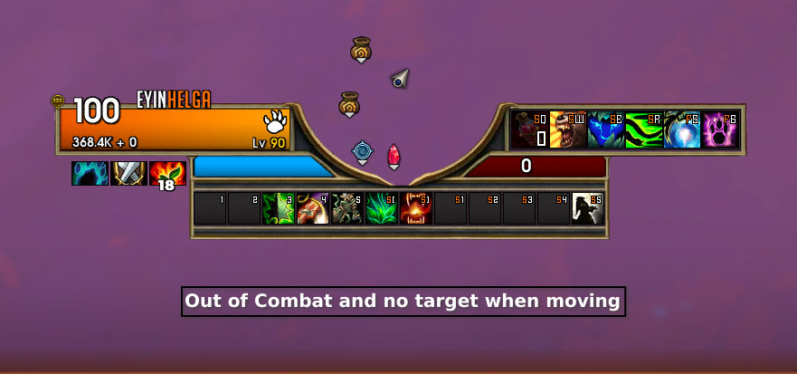
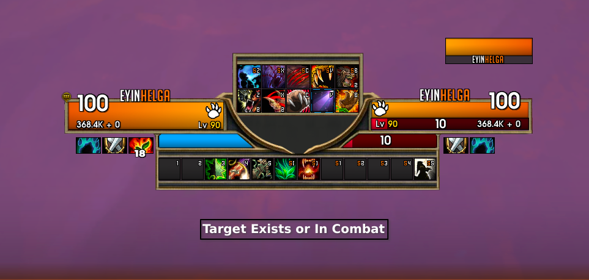
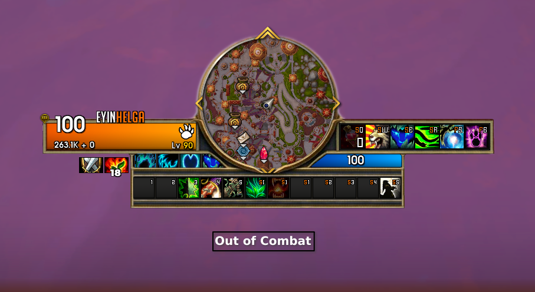

# CardinalUI

A curated set of addons and presets designed to enhance your **World of Warcraft** interface while keeping it **clean, modern, and efficient**.

CardinalUI focuses on:
- Very minimal clutter
- Strong visual clarity
- Compatibility with WoW: Midnight

---

# Showcase

CardinalUI dynamically adapts its layout based on your current game state.

## Out of Combat — Moving, No Target
> Minimalist view when you're travelling with no target selected. The UI collapses to reduce visual noise and keep your screen clear.

---

## Target Exists or In Combat
> Full combat layout activates automatically when you have a target or enter combat. Target frames, buffs, and debuffs expand for maximum situational awareness.

---

## Out of Combat — Stationary
> When standing still and out of combat, the minimap and additional panels are shown for easy navigation and information access.

---

# Addons

## Required Addons
These addons are **mandatory** for CardinalUI to function properly.

- **[ElvUI](https://tukui.org/elvui)** — Core UI framework
- **[Universal Frame Anchor (UFA)](https://www.curseforge.com/wow/addons/frame-anchor-ui-builder)** — Custom frame positioning
- **[WeakTextures](https://www.curseforge.com/wow/addons/weaktextures)** — Texture support for WeakAuras/UI elements
- **[ElvUI ActionBarBuddy](https://github.com/Repooc/ElvUI_ActionBarBuddy)** — Advanced action bar layout tools
- **[DynamicCam](https://www.curseforge.com/wow/addons/dynamiccam)** — Dynamic camera profiles
- **[ToxiUI](https://www.curseforge.com/wow/addons/toxiui)** — Additional ElvUI modules

---

## Recommended Addons
Optional addons that **enhance the overall experience** but are not strictly required.

- **[TipTac](https://www.curseforge.com/wow/addons/tip-tac)** — Enhanced tooltips
- **[Movable LFG Eye](https://www.curseforge.com/wow/addons/movablelfgeye)** — Move the LFG eye icon
- **[WaypointUI](https://www.curseforge.com/wow/addons/waypointui)** — Navigation and waypoint enhancements

---

# Installation
## 1. Import Presets
Each preset is a text string you copy and paste directly into the addon's import dialog in-game. All preset files are located in the /Presets folder.

ElvUI

Open the ElvUI config — /ec in chat
On the general tab, change the UI Scale to 0.53
Navigate to the Buff/Debuffs tab
Uncheck the enable box
Navigate to Profiles → Import
Copy the contents of ElvUI.txt and paste into the import box
Confirm the import

Frame Anchor (UFA)

Open the UFA config in-game
Navigate to the Import option
Copy the contents of FrameAnchor.txt and paste into the import box
Confirm the import

WeakTextures

Open the WeakTextures config in-game
Navigate to the Import option
Copy the contents of WeakTextures.txt and paste into the import box
Confirm the import

## 2. DynamicCam Setup
DynamicCam does not yet support profiles, so it requires manual setup. Full step-by-step instructions for configuring the two required situations are provided in /Presets/DynamicCam.txt.
